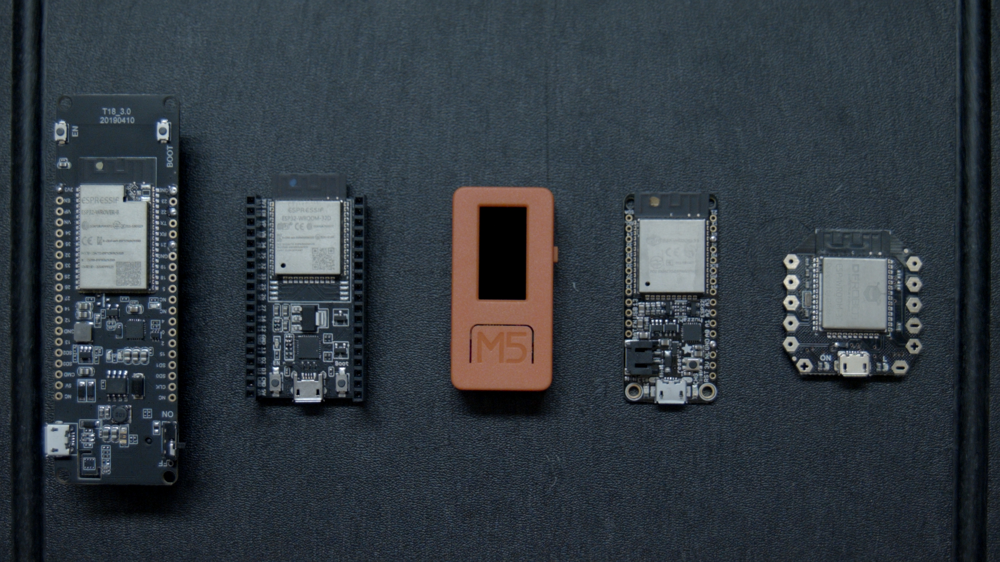
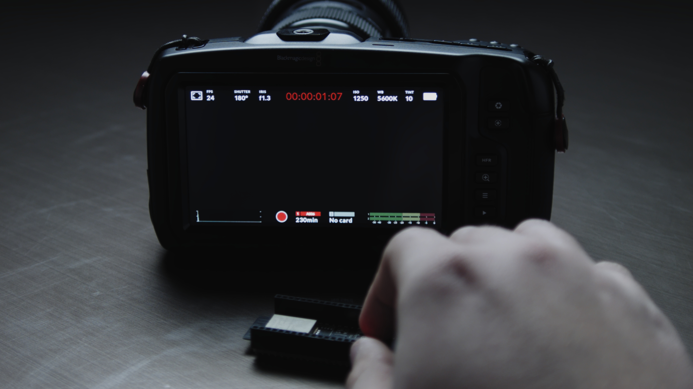
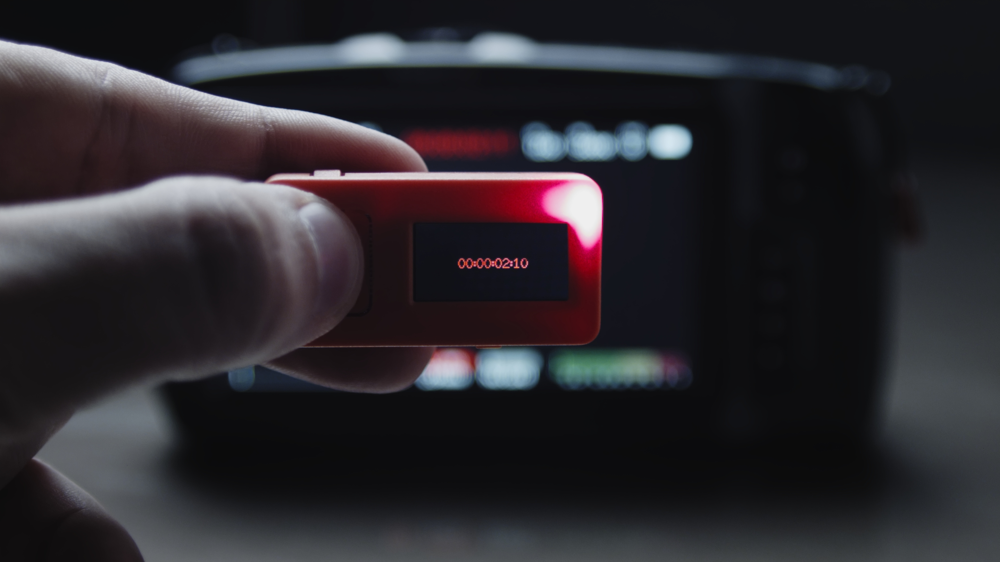
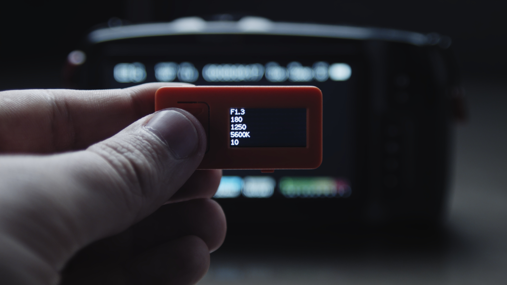

# BlueMagic32

  

Arduino ESP32 Library for connecting to Blackmagic Cameras using Bluetooth Low Energy.

Control/Read camera parameters like Recording, Focus, Aperture, Shutter Angle, White balance, etc...

#### Tested With BlackMagic Pocket Cinema Camera 4K

# Background

[This project's roots start way back in January 2019](https://forum.blackmagicdesign.com/viewtopic.php?f=2&t=82040#p473595)

Bluetooth Camera control apps are great! but whether you need a physical/tactile button as a record trigger to use on your rig or you're creating your own custom camera control solution, apps can have their limits. But no more!

ESP32 is a micro-controller from Espressif that can be found in lots of low-cost / pre-made designs and has features like WiFi and Bluetooth!

This library should work with vrtiually any ESP32 device, but for those stepping into the scene for the first time I would highly recommend the [M5StickC](https://m5stack.com/products/stick-c) as this development device comes with a builtin display, buttons, battery and lots more!

[](https://vimeo.com/376290054)




# Getting Started

## Installation

### Video 

Demonstration of how to install all the required software components and simple real world demo. 

[](https://vimeo.com/386151760)


### Prerequisites

You will need to install these software packages first. Get the latest version of the Arduino IDE ( version 1.8 or later ) and the ESP32 Arduino library ( version 1.0.4 or later ). Below are download links / guides on how to install them.

- [Arduino IDE](https://www.arduino.cc/en/main/software)

- [ESP32 Arduino Library](https://github.com/espressif/arduino-esp32/blob/master/docs/arduino-ide/boards_manager.md)

If using an M5StickC you also need to install their library:

- [M5StickC Library](https://github.com/m5stack/M5StickC)

### Installing BlueMagic32

Download this repository as a .zip file and add it to the Arduino Library.

In the Arduino IDE in the toolbar go to:

- _Sketch > Include Library > Add .ZIP Library_

## Usage

#### Setup & First Connection

Include the library in your sketch

```
#include <BlueMagic32.h>
```

Create a connection with a device name ( here we use "BlueMagic32" it will show up as the device connected to the camera.) and get the controller object, this should be done in your setup(). We also start Serial here for later use.

```
void setup() {

    Serial.begin(115200);
    BMDConnection.begin("BlueMagic32");
    BMDControl = BMDConnection.connect();

}
```

Upon your first connection, you will need to enter the passcode displayed on your camera. To do this we will open the built in Serial Monitor by going to:

- _Tools > Serial Monitor_

Make sure the baud rate is the same as what we have declared in the setup(), which in this case is: 115200

- _115200 baud_

Now also make sure line ending is set to: Newline

- _Newline_

When the camera displays the passcode, enter that code into the input box at the top and click send. Afterwards the ESP32 and the camera should now be bonded and will remember each other, so when you reboot/ power cycle your ESP32 it will autoconnect to the camera.

#### Write Settings

Upon successful connection, we can now use the controller like this:

we use the **available()** method to make sure we only read/write when a successful connection is established. Any calls to BMDControl should be wrapped in this method to make sure it is safe to call.

```
if (BMDConnection.available()) {

    // Starts recording
    BMDControl->record(true);

    // Sets ISO to 1250
    BMDControl->iso(1250);

    // Sets absolute focus, 0.0 near -> 1.0 far
    BMDControl->focus(0.5);

    // Sets white balance to 5600k
    BMDControl->whiteBalance(5600);

}
```

#### Read Settings

To read camera settings live, we can use the **changed()** method to only update our variables when the camera settings change:

```
if(BMDControl->changed()){

    // Get recording state
    bool recording = BMDControl->isRecording();

    // Get the current shutter setting ( as shutter angle )
    int shutter = BMDControl->getShutter();

    // Get the current frame rate setting
    int frameRate = BMDControl->getFrameRate();

    // Get the current iso setting
    int iso = BMDControl->getIso();

}
```

#### Timecode

To get live timecode:

```
// Get the current timecode as a string
String tc = BMDControl->timecode();

// Get the current timecode as a number
long tc = BMDControl->timecodeRaw();
```

#### Custom Commands

For advanced users, you can use the **custom()** method to send your own data array for camera control:

```
// send the start recording command
uint8_t data[12] = {255, 5, 0, 0, 10, 1, 1, 0, 2, 0, 0, 0};
BMDControl->custom(data, 12);
```

#### Connection Management

When you wish to connect to another camera or need to rebond your ESP32 to the camera you need to:

- Clear the existing bond on your ESP32 by calling this method:
  ```
  BMDConnection.clearPairing();
  ```
- Clear the paired devcies on your camera.

## API Reference

#### Connection Methods

```
  void begin();
  void begin(String name);

  bool scan(bool active, int duration);

  BlueMagicCameraController *connect();

  void disconnect();

  void clearPairing();

  bool available();
```

#### Controller Methods

```
  bool changed();

  void setCamera(uint8_t index);
  void custom(uint8_t *data, size_t len);

  uint8_t getCameraStatus();
  int8_t getTransportMode();

  void record(bool recording);
  void toggleRecording();
  bool isRecording();

  void play(bool play);
  bool isPlaying();

  void preview(bool preview);
  bool isPreviewing();

  void codec(CODEC_TYPE c, CODEC_QUALITY q);
  int8_t getCodecType();
  int8_t getCodecQuality();

  void focus(float value);
  float getFocus();
  void instantAutoFocus();

  void ois(bool enabled);
  bool getOis();

  void zoom(float value);
  float getZoom();

  void aperture(float value);
  void autoAperture();
  float getAperture();

  void autoExposureMode(int value);

  void iso(int32_t iso);
  int32_t getIso();

  void shutterSpeed(int32_t value);
  void shutterAngle(int32_t value);
  int32_t getShutter();

  void whiteBalance(int16_t whiteBalance, int16_t tint);
  void autoWhiteBalance();
  int16_t getWhiteBalance();
  int16_t getTint();

  void frameRate(int16_t frameRate);
  int16_t getFrameRate();

  void sensorFrameRate(int16_t sensorFrameRate);
  int16_t getSensorFrameRate();

  void resolution(int16_t width, int16_t height);
  int16_t getFrameWidth();
  int16_t getFrameHeight();

  String timecode();
  uint32_t timecodeRaw();


  // for advanced users looking to see raw data streaming from the ble characteristics, use these methods:

  bool settingsChanged();
  uint8_t *settingsData();

  bool timecodeChanged();
  uint8_t *timecodeData();

  bool statusChanged();
  uint8_t *statusData();

```

## Examples

Included in the library are a couple of basic examples to get you up and running. These are located in the examples folder and can be found in the Arduino IDE by going to:

- _File > Examples > BlueMagic32_

Open them, adjust yoru board settings and upload!

### Basic Remote Trigger

Start/Stop recording using the built-in boot button.



### M5StickC Trigger with Timecode

Start/Stop recording using the builtin button with live timecode display.



### M5StickC Settings Display

Display live camera settings on the builtin screen.



# Donation

If this project helped you and you want support more cool projects like it:

[](https://www.paypal.com/cgi-bin/webscr?cmd=_s-xclick&hosted_button_id=ZDU59MDJ3VXF6&source=url)

# Acknowledgments

- BlackMagic Design's awesome [SDK](https://www.blackmagicdesign.com/developer/product/camera)!
- [nkolban](https://github.com/nkolban/esp32-snippets/tree/master/cpp_utils/tests/BLETests/Arduino) BLE examples
